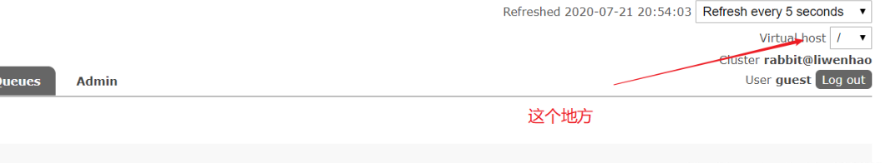

# mq-demo
这是一个个人学习rabbitmq的项目

# 运行代时可能的错误
##  channel error
```shell
Caused by: com.rabbitmq.client.ShutdownSignalException: channel error; protocol method: #method<channel.close>(reply-code=404, reply-text=NOT_FOUND - no queue ‘queue_cms_postpage’ in vhost ‘/’, class-id=50, method-id=10)
```
第一种：权限问题。问题在in vhost '/'在RabbitMQ 管理界面，把Exchanges，和Queues两个栏目的Virtual host 从"ALL"，改为"/"即可。

第二种：由于rabbitmq 消费者 监听消息队列时， 消息队列没有创建 导致上面的异常。
第三种：第一次创建rabbitmq交换机后，更改交换机类型，继续创建时出现。原因时存在同名的交换机。比如rabbitmq服务器中已经存在direct类型的交换机（name=“exchange”），你再创建一个同名的但是类型为fanout时就会出错，需要更换名字后再创建。
